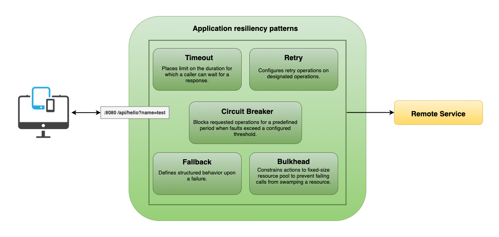
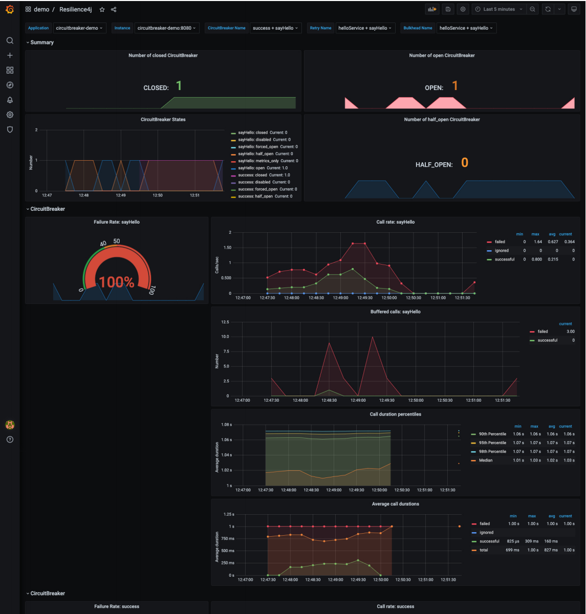

# Spring Circuit Breaker (resilience4j demo)

This repository demonstrates how to build fault-tolerant application and apply resiliency patterns using Resilience4j.

## Features

* Example of most common resilience patterns (circuit breaker, retry, bulkhead and time limiter).
* Metrics.
* Micrometer/Prometheus integration.
* Resilience4j Grafana dashboard.
* Docker compose running demo.

## Application Diagram



## Getting Started

### Prerequisite

* Java 11
* Docker
* Docker-Compose
* [ab](https://httpd.apache.org/docs/2.4/programs/ab.html) - Apache HTTP server benchmarking tool

### Installation

Build docker image.

```shell
./gradlew bootBuildImage
```

### Usage

* Start docker compose (keycloak and postgres)
  ```shell
  cd docker
  
  docker-compose up -d
  ```

* List containers and check if all are *Up*.
  ```shell
  docker-compose ps   

  #        Name                      Command                  State               Ports         
  # --------------------------------------------------------------------------------------------
  # circuitbreaker-demo   /cnb/process/web                 Up             0.0.0.0:8080->8080/tcp
  # grafana               /run.sh                          Up (healthy)   0.0.0.0:3000->3000/tcp
  # prometheus            /bin/prometheus --config.f ...   Up (healthy)   0.0.0.0:9090->9090/tcp
  ```

* Generate website traffic using [Apache Benchmark](https://httpd.apache.org/docs/2.4/programs/ab.html) tool.
  ```shell
  # Circuit Breaker - `sayHello`
  ab -t 60 -c 20 http://localhost:8080/api/hello?name=ab_test
  
  # Circuit Breaker - `success` 
  ab -t 30 -c 10 http://localhost:8080/api/hello/success
  ```

* Open your web browser and go to Grafana [login page](http://localhost:3000/). On the login page, enter `admin` for a
  username and password.

* Open `demo/Resilience4j` dashboard. You should be able to see circuit breaker metrics as shown below:
  

* Stop demo and cleanup volumes.
  ```shell
  docker-compose down -v
  ```

## Important Endpoints

| Name | Endpoint | 
| -------------:|:--------:|
| `Demo application` | http://localhost:8080 |
| `Prometheus` | http://localhost:9090/ |
| `Grafana` | http://localhost:3000/ |
| `Actuator endpoint` | http://localhost:8080/actuator |
| `Bulkheads - Actuator` | http://localhost:8080/actuator/bulkheads |
| `Bulkheads events - Actuator` | http://localhost:8080/actuator/bulkheadevents |
| `Micrometer Prometheus - Actuator` | http://localhost:8080/actuator/prometheus |
| `Circuit breakers - Actuator` | http://localhost:8080/actuator/circuitbreakers |
| `Circuit breakers events - Actuator` | http://localhost:8080/actuator/circuitbreakerevents |
| `Rate limiters - Actuator` | http://localhost:8080/actuator/ratelimiters |
| `Rate limiters events - Actuator` | http://localhost:8080/actuator/ratelimiterevents |
| `Retries - Actuator` | http://localhost:8080/actuator/retries |
| `Retries events - Actuator` | http://localhost:8080/actuator/retryevents |
| `Time limiters - Actuator` | http://localhost:8080/actuator/timelimiters |
| `Time limiters events - Actuator` | http://localhost:8080/actuator/timelimiterevents |
| `Actuator health` | http://localhost:8080/actuator/health |

## Additional tips

### Replacing java annotations with custom resiliency4j operator.

```java
import io.github.resilience4j.circuitbreaker.CircuitBreaker;
import io.github.resilience4j.circuitbreaker.CircuitBreakerRegistry;
import io.github.resilience4j.reactor.circuitbreaker.operator.CircuitBreakerOperator;
import reactor.core.publisher.Mono;

// example how to decorate a Mono using custom Reactor operator.
public class IfYouHateAnnotationsServiceExample {

	private final CircuitBreaker circuitBreaker;

	public IfYouHateAnnotationsServiceExample(CircuitBreakerRegistry circuitBreakerRegistry) {
		circuitBreaker = circuitBreakerRegistry.circuitBreaker("hello_world");
	}

	Mono<String> helloWorld() {
		return Mono.fromCallable(() -> "Hello World!")
				   .transformDeferred(CircuitBreakerOperator.of(circuitBreaker));
	}
}
```

## References

For further reference, please consider the following sections:

* [Application resiliency patterns](https://docs.microsoft.com/en-us/dotnet/architecture/cloud-native/application-resiliency-patterns)
* [Resilience4J](https://docs.spring.io/spring-cloud-circuitbreaker/docs/current/reference/html/index.html)
* [Getting started with resilience4j-spring-boot2](https://resilience4j.readme.io/docs/getting-started-3)
* [Examples of resilience4j-reactor](https://resilience4j.readme.io/docs/examples-1)
* [Resilience4j Grafana Dashboard](https://resilience4j.readme.io/docs/grafana-1)
* [Prometheus](https://docs.spring.io/spring-boot/docs/2.4.4/reference/html/production-ready-features.html#production-ready-metrics-export-prometheus)

## License

Distributed under the MIT License. See `LICENSE` for more information.